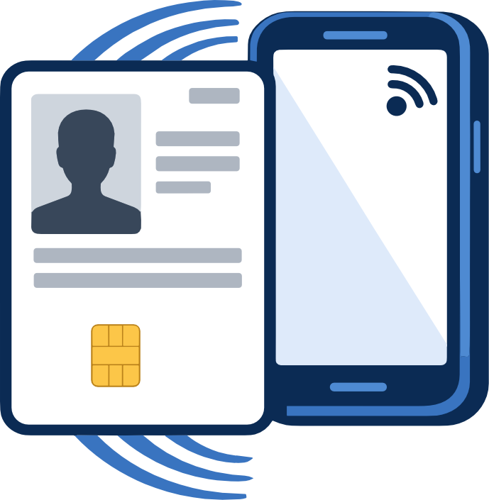

  

# PIV Reader for iOS

A native iOS app for reading, validating, and authenticating with PIV (Personal Identity Verification) smart cards.

---

## What It Does

PIV Reader turns your iPhone into a PIV credential reader and authenticator. It communicates with PIV smart cards over **NFC** (contactless) and **USB** smart card readers to:

- **Read certificates** — Card Authentication, PIV Authentication, Digital Signature, and Key Management certificates
- **Validate certificate chains** — Against FPKI trust anchors or your own custom CA certificates
- **Authenticate cards** — Challenge-response proof that the card holds its private key
- **Establish Secure Messaging** — Encrypted NFC communication using ECDH key agreement (P-256/P-384)
- **Support VCI** — Virtual Contact Interface for accessing protected data objects over NFC with pairing codes
- **Enable Safari mTLS** — Registered PIV cards can be used for client certificate authentication in Safari via a CryptoTokenKit extension

## Card Registration

Register PIV cards to a local database for quick identity lookup. Registration extracts the cardholder's name, organization, and UUID from the PIV Authentication certificate. Saved pairing codes enable automatic VCI establishment, and PINs can be stored with Face ID / Touch ID protection for seamless Safari authentication.

## Safari Client Certificate Authentication

PIV Reader includes a CryptoTokenKit token extension that exposes registered PIV certificates to Safari and other iOS apps. When a website requests mutual TLS client certificate authentication, your registered PIV card appears as an option. Selecting it prompts you to tap your card (NFC) or connect via USB to perform the signature — the private key never leaves the card.

## Privacy

PIV Reader processes all card data locally on your device. No personal data is collected, stored on external servers, or shared with third parties. Network access is limited to downloading publicly available Federal PKI certificates.

[Full Privacy Policy](privacy.md)

## Requirements

- iOS 16.0 or later
- iPhone with NFC (for contactless)
- USB smart card reader (optional, for contact interface)

## Support

For bug reports, feature requests, or questions:

- **GitHub Issues:** [github.com/regenscheid/piv-ios-reader/issues](https://github.com/regenscheid/piv-ios-reader/issues)
- **Email:** [andy@pivforge.com](mailto:andy@pivforge.com)

[Full Support Page](support.md)

## Source Code

PIV Reader is open source. View the code and contribute on GitHub:

[github.com/regenscheid/piv-ios-reader](https://github.com/regenscheid/piv-ios-reader)
